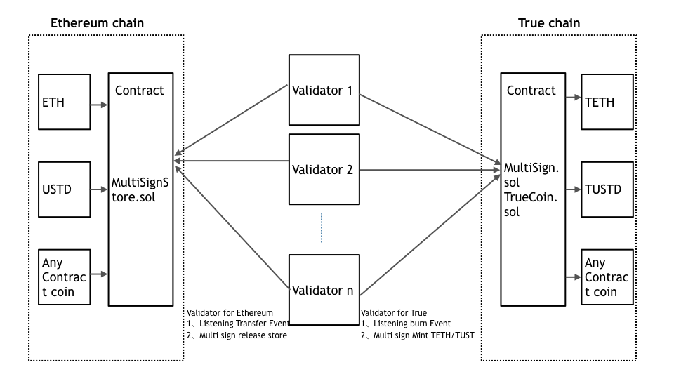

# Example: ETH to True bridge Document

## Token bridge introduction

* The ETH-TRUE Token Bridge includes two multi-sig contracts on two chains, Any ethereum  contract token on TrueChain and several validators vote on cross-chain transactions.

## ETH token cross to true chain featue

* support all ETH contract coin inclue ETH

* only need depoly one store contract 

* support the multi sign validator to mint/burn/release token to make sure trust

* Automatic create coin contract at TRUE chain

* support 1-100 validator

### Any Ethereum contract coin  from Ethereum to TrueChain

